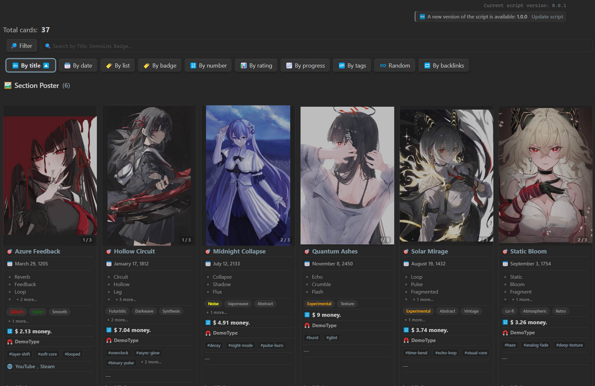

**English** | **[Русский](README_RU.md)**

# 🎴 **Universal Dataview Cards**

> A powerful script for displaying customizable cards in Obsidian, built with DataviewJS. Includes support for sections, filtering, sorting, embedded media, progress bars, and more.  
> Fully compatible with any Obsidian theme.


---


---

## 📸 **Interface Example**

_A simple example of an interface with books and movies_


---

## ✨ **Script Features**

| Feature                    | Description                                             |
| -------------------------- | ------------------------------------------------------- |
| 🎴 Card layout             | Visual representation of notes as individual cards      |
| 🔍 Filtering & sorting     | By type, folder, tags, or custom fields                 |
| 🧠 Section logic           | Automatically sort cards into different visual sections |
| 🎨 Customization           | Emojis, colors, order, custom CSS classes               |
| 📈 Progress, rating, icons | Display metrics visually right inside each card         |
| 🖼️ Image slider            | Switchable gallery inside the card                      |
| 🔊 Embedded media          | Supports MP3, MP4, OGG, and more                        |
| 🧩 Extensibility           | Flexible config for any structure or use case           |
| 💾 Persistent settings     | Configuration is saved between Obsidian sessions        |

---

## 🎥 **Video Demo**

[](https://youtu.be/rI1jzhVrjAs)

▶️ **Click the image to watch a video demonstration**

---

## **Script Capabilities**

### ⚙️ What the Script Can Do:

The script transforms YAML entries (metadata) in Obsidian into beautiful, interactive cards with filters, sections, and visual components.

### ✨ What Can You Use This Script For?

🎓 Knowledge Base  
Group content by topic, track progress, add tags and ratings.

📺 Movie & TV Show Catalog  
Each card represents a movie or series: cover, title, genres, rating, video, and even soundtrack.

📚 Study Plans  
Visualize completed materials, progress in percentages, grades, and deadlines.

🧠 Idea and Note Collections  
Use filters and sections to track the status of each idea.

> No matter what you want to track — books, movies, tasks, or people — everything will be clean, structured, and interactive.

---

## 📦 **Required Plugins & Themes**

To ensure proper functionality, it's recommended to install the following components:

1. 🔌 [`Dataview`](https://github.com/blacksmithgu/obsidian-dataview) — Required. Powers the data logic behind the cards.
2. 🎛 [`Style Settings`](https://github.com/mgmeyers/obsidian-style-settings) _(optional)_ — For advanced visual customization, especially with the Minimal theme.
3. 🎨 [`Minimal Theme`](https://github.com/kepano/obsidian-minimal) _(optional)_ — A fully compatible theme for the best visual experience.

> ⚠️ The script **won't work without `Dataview`**. The other components are optional, but recommended for full styling support.

---

## 🚀 How to Start Using the Script

Choose one of the three options to get started:

### 🔹 Option 1: Download the Release Archive

📦 [Download ready-to-use archive (v1.0.0)](https://github.com/2PleXXX/obsidian-dataview-cards/releases/download/v1.0.0/obsidian-dataview-cards-1.0.0.rar)

### 🔹 Option 2: Manual Download from GitHub

1. Go to the repository:  
   👉 [https://github.com/2PleXXX/obsidian-dataview-cards](https://github.com/2PleXXX/obsidian-dataview-cards)

2. Click the green **"Code"** button and select **"Download ZIP"**.

### 🔹 Option 3: Clone via Git

```bash
git clone https://github.com/2PleXXX/obsidian-dataview-cards.git
```

✅ After Downloading:

1. Unpack the archive (if you downloaded ZIP/RAR).
2. In Obsidian, open the extracted Obsidian-Vault folder as a new Vault.
3. Open the homepage (HUB) inside the vault.

   👉 I recommend starting with the note "Starting Point".

---

> ℹ️ **Disclaimer**
>
> The appearance shown in demo images and videos may differ slightly from the current version of the script, as updates may be released over time.
